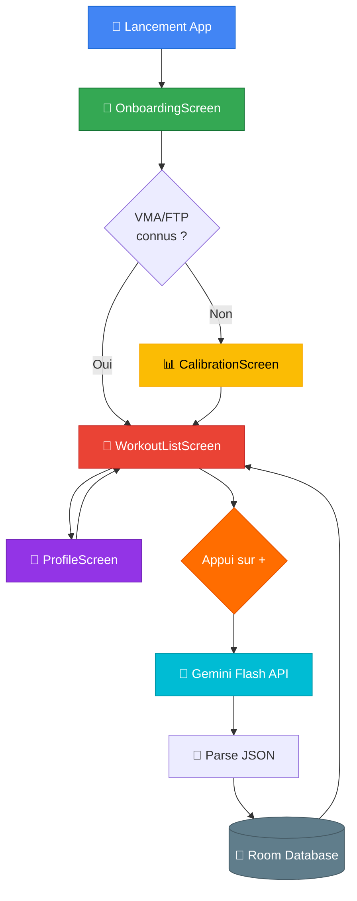
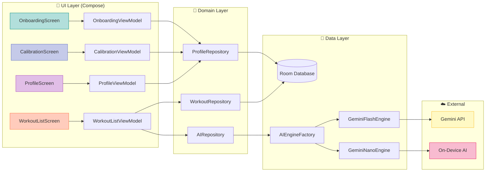
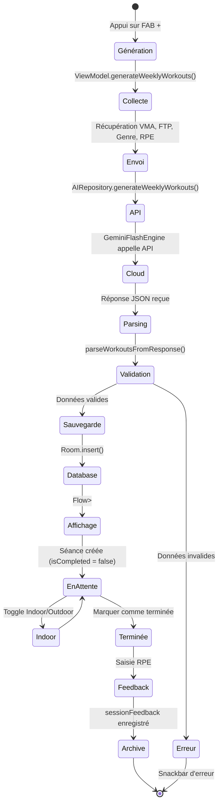
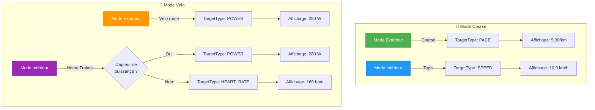
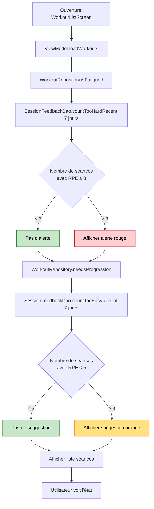
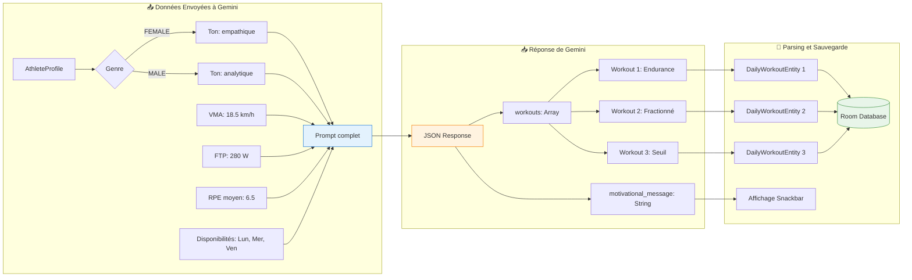
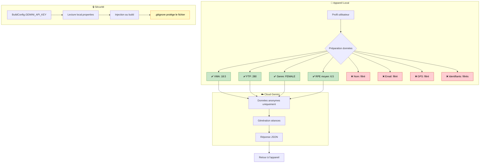
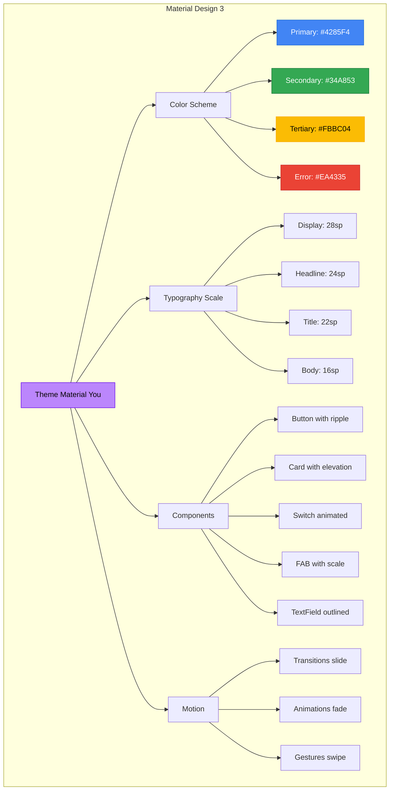

# Flux Visuel - EnduranceFlow Android

Ce document contient des diagrammes visuels interactifs de l'application.

## 🔄 Diagramme de Navigation



## 🎨 Architecture des Composants UI



## 📊 Cycle de Vie d'une Séance



## 🔄 Indoor/Outdoor - Transformation des Cibles



## ⚠️ Détection de Fatigue - Flowchart



## 🤖 Prompt IA - Structure de Données



## 🔐 Architecture Privacy-First



## 📈 Timeline d'Utilisation

```mermaid
gantt
    title Parcours Utilisateur Type (Première Semaine)
    dateFormat YYYY-MM-DD
    section Jour 1
    Installation & Onboarding     :done, 2026-01-18, 5m
    Tests de Calibration (VMA/FTP):done, 2026-01-18, 30m
    section Jour 2
    Génération programme semaine  :done, 2026-01-19, 1m
    Séance 1: Endurance           :active, 2026-01-19, 60m
    Feedback RPE                  :done, 2026-01-19, 1m
    section Jour 4
    Séance 2: Fractionné 30/30    :2026-01-21, 45m
    Feedback RPE                  :2026-01-21, 1m
    section Jour 6
    Séance 3: Seuil vélo          :2026-01-23, 50m
    Feedback RPE                  :2026-01-23, 1m
    section Jour 7
    Consultation profil & zones   :2026-01-24, 5m
    Génération nouvelle semaine   :2026-01-24, 1m
```

## 🎨 Composants Material 3



---

## 📊 Visualisation GitHub

Ces diagrammes sont rendus automatiquement sur GitHub grâce à Mermaid.
Pour les voir en couleur :

1. **Sur GitHub** : Ouvrez ce fichier dans votre repository
2. **Localement** : Utilisez [Mermaid Live Editor](https://mermaid.live/)
3. **VS Code** : Installez l'extension "Markdown Preview Mermaid Support"

## 🚀 Pour Voir l'Application Réelle

### Option 1 : Android Studio
```bash
cd /home/user/App
# Ouvrir dans Android Studio
# Sync Gradle
# Lancer sur émulateur (Ctrl+R)
```

### Option 2 : Build APK
```bash
./gradlew assembleDebug
# APK dans : app/build/outputs/apk/debug/app-debug.apk
```

### Option 3 : Instant Run
```bash
adb install app/build/outputs/apk/debug/app-debug.apk
```

---

**Ces diagrammes montrent visuellement comment l'application fonctionne ! 🎨**
